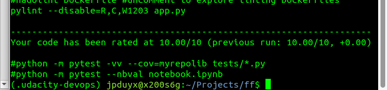
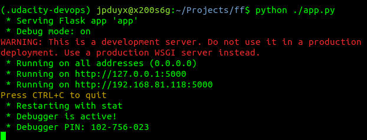
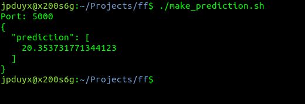

# Overview

This code is supposed to run with  python (tesed with 3.10 version) using the requirements defined in requirements.txt

For python we need the venv module and pip module in python. 
To deploy the code to run on Azure App service we need Github Actions or Azure Devops Pipelines and a virtual machine as agent to run the pipeline. 

## Project Plan

* https://trello.com/b/NjPD2o5q/udacity-project-6
* quarterly plan spreadsheet [project-management.xlsx](docs/project-management.xlsx) 

## Architectural Diagram CICD

On every commit/pushed into github the code has to be tested and if the test completes without errors, the new code will be delivered into production by azure pipelines. 

## Instructions for running the Python project locally

 
      git clone https://github.com/jpduyx/udacity-project-6.git

      # The Makefile is used to prepare the environment.
      make setup

      # activate the created venv: 
      source ~/.udacity-devops/bin/activate

      make all

If all is installed well, you can run the code

      python3 app.py

The app should be running now, this looks like: 

Open a second terminal and run the shell script for a local prediction:

      ./make_prediction.sh 

The prediction based on the example code should give a result like: 

## Instructions for runing on Azure

* Project running on Azure App Service

* Project cloned into Azure Cloud Shell

* Successful deploy of the project in Azure Pipelines.  [Note the official documentation should be referred to and double checked as you setup CI/CD](https://docs.microsoft.com/en-us/azure/devops/pipelines/ecosystems/python-webapp?view=azure-devops).

* Running Azure App Service from Azure Pipelines automatic deployment

* Successful prediction from deployed flask app in Azure Cloud Shell.  

* Output of streamed log files from deployed application

>

## Enhancements

1. Investigate if we can run this project serverless as a function to make deployment easier and also possible to run in kubernetes
2. Create a new screencast after recovering from nose and throat cold
3. Make tests and get a good testcodecov

## Demo

