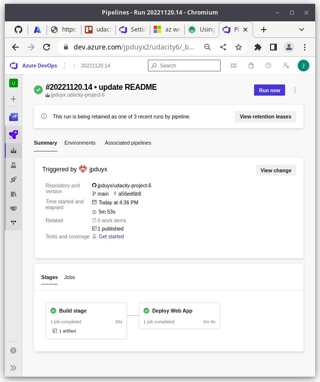

# Overview

This code is supposed to run with  python (tesed with 3.10 version) using the requirements defined in requirements.txt

For python we need the venv module and pip module in python. 
To deploy the code to run on Azure App service we need Github Actions or Azure Devops Pipelines and a virtual machine as agent to run the pipeline. 

## Project Plan

* https://trello.com/b/NjPD2o5q/udacity-project-6
* quarterly plan spreadsheet [project-management.xlsx](docs/project-management.xlsx) 

## Architectural Diagram CICD

On every commit/pushed into github the code has to be tested and if the test completes without errors, the new code will be delivered into production by azure pipelines. 

## Instructions for running the Python project locally

 
      git clone https://github.com/jpduyx/udacity-project-6.git

      # The Makefile is used to prepare the environment.
      make setup

      # activate the created venv: 
      source ~/.udacity-devops/bin/activate

      make all

You can now see how the age old make does the basics of automation and builds an environment with all the requirements installed and it also runs a basic lint test to check the code quality.  

If all is installed well and the code is okay like in the picture above, you can run the code:

      python3 app.py

The app should be running now, this looks like: 

Open a second terminal and run the shell script for a local prediction:

      ./make_prediction.sh 

The prediction based on the example code should give a result like: 

## Instructions for runing on Azure

Azure has a service to run web applications. 
Our application looks like this when running there.

To run the app on azure we need: an azure account and create Azure App service (with the command line). Open the azure cloud shell and run: 

      git clone https://github.com/jpduyx/udacity-project-6.git 
      cd udacity-project-6
      az webapp up -n MyUniqueAppName

And we can make an automated test/deploy pipeline with Azure DevOps Pipelines. Setting up a pipeline is a project in itself, and subject to change (azure develops quickly). I would sugest to check the Azure documentation for this or chieck the azure-pipeline.yml file for inspiration. 

Once you have the pipeline configured, it will show up in github actins and the little symbol next to the last committed update.

To configure and check the azure pipelines for testing and deployment, use https://dev.azure.com/. 
If you don't have an organization setup here, this is step 1. Then connect the pipeline with github and with azure app service. Perhaps you also need to make a dedicated cloud build agent, if parallelisme doesnt work in your build pipeline. If you don't need azure pipelines and don't need all this hassle i would suggest just to use the github pipeline which works more or less out of the box. 

A succesful azure pipeline deployment looks like this: 

When we open the app in azure app service this is where we see that the app was deployed with the service named "VSTRM"

When all works, you can run the machine learning prediction model on our test data with the provided script (make sure to change the app name to the newly deployed app name). 

      ./make_predict_azure.sh

## Troubleshooting with azure log stream

when things don't work like they should, azure comes with handy tools to help troubleshooting, like viewing the log stream. (this didn't work in my environment, when i click on "View log stream" button nothing happens, not even an error message. 

")

But if you use the menu on the left and click "Log stream" it does work fortunately. 

## Future enhancements

1. Investigate if we can run this project serverless as a function to make deployment easier and also possible to run in kubernetes
2. Create a new screencast after recovering from nose and throat cold
3. Make tests and get a good testcodecov

## Demo

